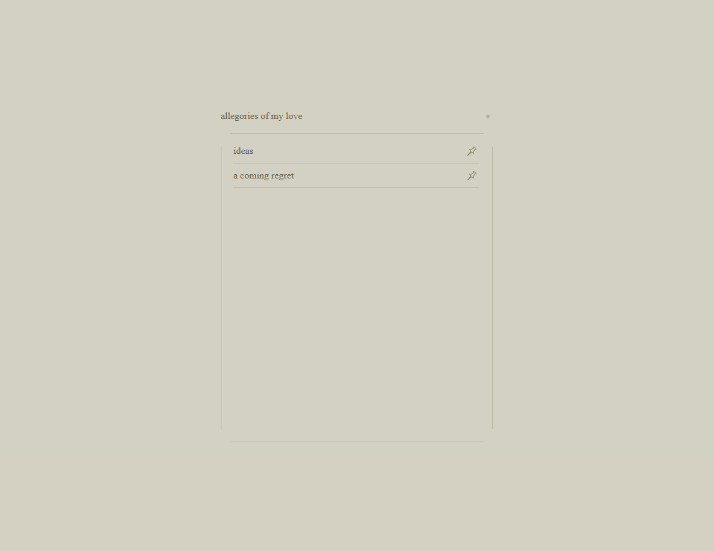
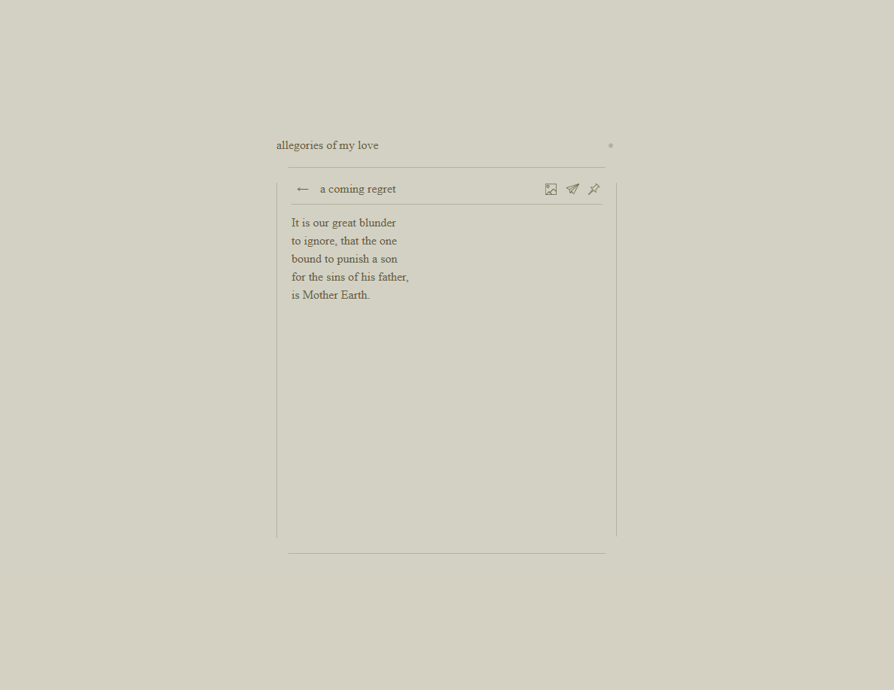

## allegoriesofmy.love

A deeply personal project to act as an archive for my poetry. With it, I aim to communicate my phenomenology, as a direct consequence of my subjective, lived experience of the human condition.

[allegoriesofmy.love](https://allegoriesofmy.love)

### User Features

* Enjoy a minimal interface; allow each writing to speak for itself, by itself.
* Pin writings you like to the top of your feed, for easy access next time.
* View images associated with each writing, when available.
* Change between light mode or dark mode.
* Share however you feel appropriate with an easy copy-to-clipboard function.

### Technical Features

* Built NextJS (with Tailwind) & hosted on AWS Lightsail.
* SPA via dynamic, shallow writing, with URL updates and direct access to subpages from a URL visit.
* Animations with Framer Motion.

 

  
  

#### Note

This is a newer version of this project. The previous release can be viewed at [this repo](https://github.com/juliankuyumcu/allegoriesofmy.love).
